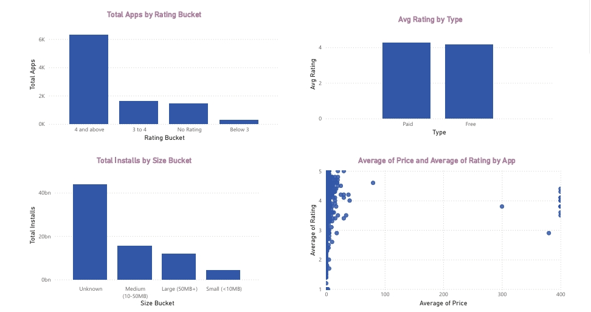
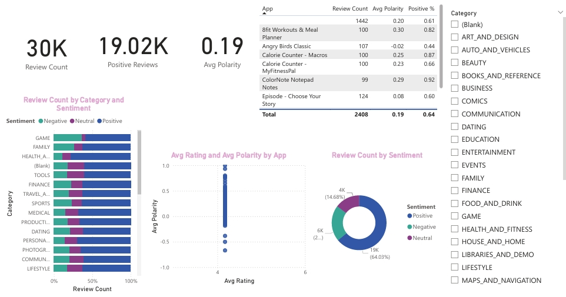
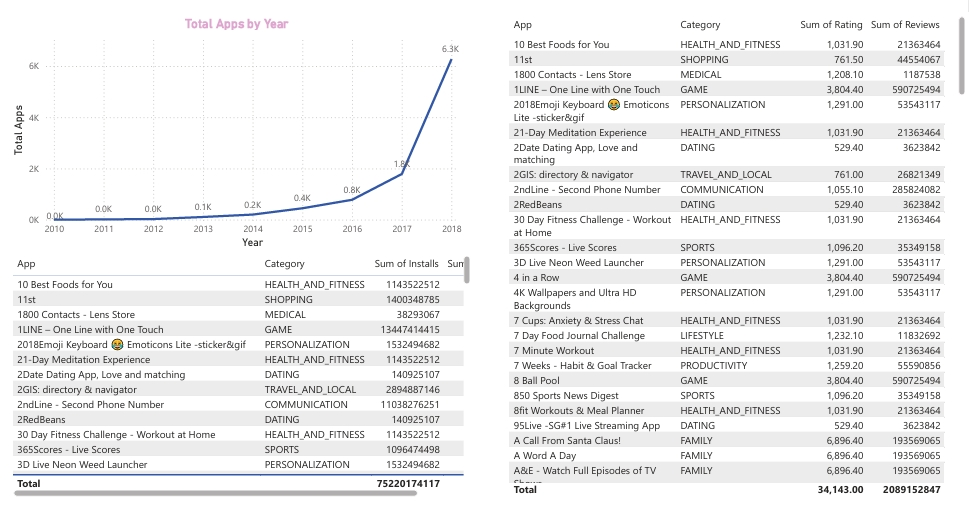
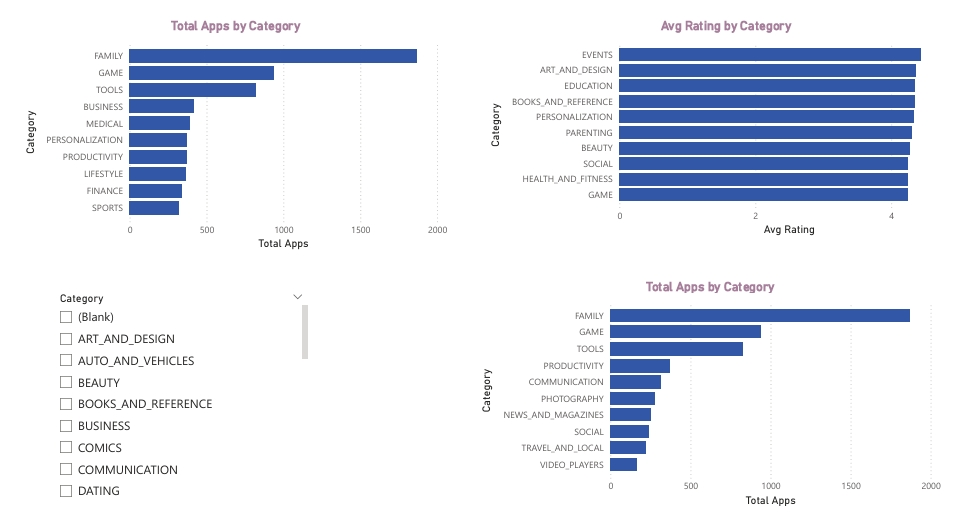

# PlayStore_Analysis
Power BI dashboard analysing Google Play Store apps and user reviews
# Google Play Store Analysis - Power BI Dashboard

## Overview
Interactive Power BI dashboard analysing Google Play Store apps and user reviews.

## Data
- `data/Play_Store_Data.csv` - app details (category, rating, installs, size, price, etc.)
- `data/User_Reviews.csv` - user review text with sentiment scores

## Data Cleaning (Power Query)
- Removed one corrupted row and duplicate apps (kept the row with the most reviews)
- Converted Installs, Price, Reviews and Size to numeric values (Size in MB)
- Replaced `nan` text with real null values
- Removed reviews with no text or sentiment
- Created Size Bucket, Rating Bucket and Update Year columns

## Dashboard Pages
1. Overview
2. Category Analysis
3. Ratings & Pricing
4. Sentiment Analysis
5. Trends & Top Apps

## Screenshots

## Key Insights
- [Add 3-5 findings from your dashboard]

## Files
- `PowerBI/PlayStore_Analysis.pbix` - Power BI report
- `PowerBI/` PDF export of the dashboard
- `screenshots/` - dashboard page images
- `data/` - source CSV files

## Tools Used
Power BI Desktop, Power Query, DAX
